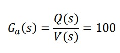
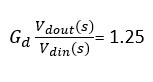

# Home-Temperature-Control
 
In this project, we want to control the indoor temperature of which is effected by the outdoor temperature and the heater.
 

 
 

__Actuator__:
 

 
Q: output heat
 
V: input voltage
 
 
__Sensor__:
 

 
Ts: the measured temperature
 
Vout: output voltage
 
 
__Heater Driver__:
 

 
Ts: the measured temperature
 
Vout: output voltage
 
 
__Sensor Optimizer__:
 
we use LM358 IC to map the sensor output amplitude to the input.
 

 
 
__Open Loop Controller__:
 
The desired temperature is 26 C and the current temperature of th house is 68.38 C. We use a simple gain as a controller. 
 

 

 
 
__Closed Loop Controller__:
 
We design a PI controller that sets T=26 C in less that 40s without overshoot.
 

 

 

 

 
We also impliment the controller using LM324. 
